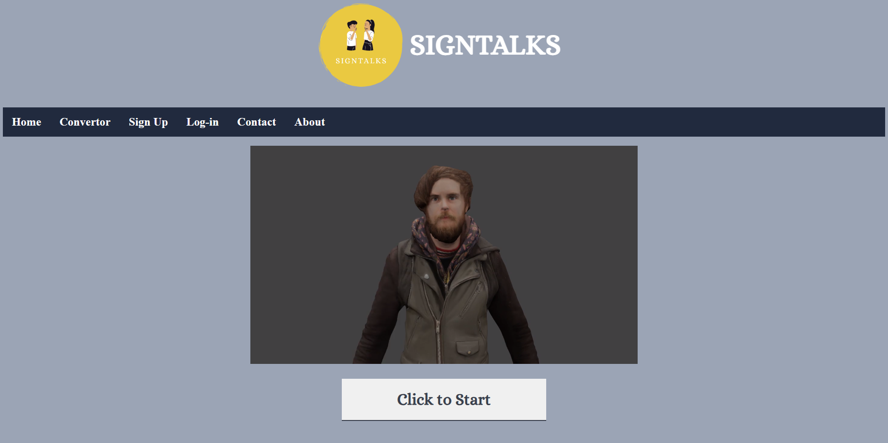
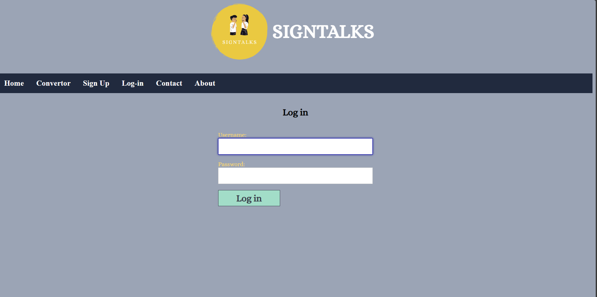
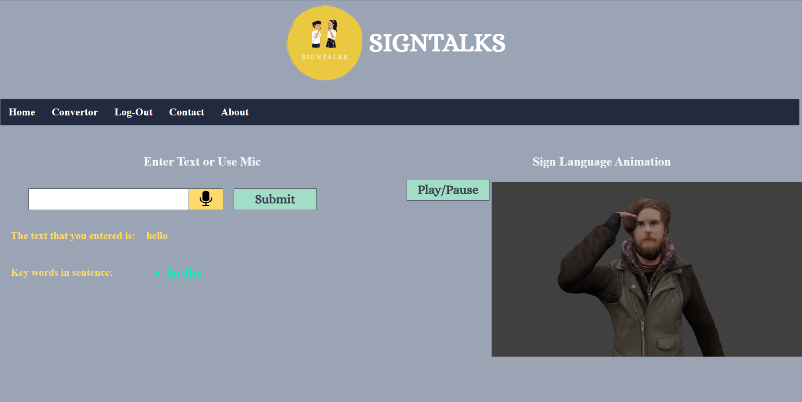

# <font face="Arial">SIGNTALKS: Convert Voice and Text to Animation for Deaf</font>

<font face="Arial">SIGNTALKS is a project aimed at converting voice and text to animations in sign language, providing a tool to facilitate communication for the deaf community.</font>

## <font face="Arial">Technologies Used</font>

- <font face="Arial"><b>HTML</b></font>: <font face="Arial">HTML is used for structuring the web application's content and interface.</font>
- <font face="Arial"><b>CSS</b></font>: <font face="Arial">CSS is used for styling the web application and enhancing its visual appeal.</font>
- <font face="Arial"><b>Python Django</b></font>: <font face="Arial">Django is a Python-based web framework used for the backend development of SIGNTALKS.</font>
- <font face="Arial"><b>NLTK Library</b></font>: <font face="Arial">NLTK (Natural Language Toolkit) is a Python library used for natural language processing tasks, such as text analysis and language translation.</font>

## <font face="Arial">Features</font>

- <font face="Arial"><b>Voice to Animation</b></font>: <font face="Arial">Convert spoken words into animated sign language.</font>
- <font face="Arial"><b>Text to Animation</b></font>: <font face="Arial">Convert written text into animated sign language.</font>
- <font face="Arial"><b>User-Friendly Interface</b></font>: <font face="Arial">Intuitive design to enhance user experience.</font>
- <font face="Arial"><b>Real-Time Conversion</b></font>: <font face="Arial">Instantaneous conversion to animations for effective communication.</font>

## <font face="Arial">Installation</font>

<font face="Arial">To use SIGNTALKS, follow these steps:</font>

1. <font face="Arial">Clone the repository:</font>
   ```bash
   git clone https://github.com/Ritiky23/SIGNTALKS.git
<font face="Arial">Install the necessary dependencies. Navigate to the project directory and run:</font>

bash
Copy code
python manage.py runserver
<font face="Arial">Access the application at http://localhost:8000 in your web browser.</font>

<font face="Arial">Usage</font>
<font face="Arial">Access the application through the provided URL.</font>
<font face="Arial">Choose the mode: "Voice to Animation" or "Text to Animation".</font>
<font face="Arial">Input the text or speak the words you want to convert.</font>
<font face="Arial">Click the "Convert" button.</font>
<font face="Arial">View the animated sign language corresponding to the input.</font>
<font face="Arial">Engage in effective communication with the deaf community using the generated animations.</font>
<font face="Arial">Screenshots</font>

<p align="center">
  
</p>
<p align="center">
  
</p>

<p align="center">
  
</p>

<font face="Arial">Contributing</font>
<font face="Arial">Contributions to SIGNTALKS are welcome! If you have ideas for new features, enhancements, or find bugs, please open an issue or create a pull request.</font>

## <font face="Arial">License</font>
<font face="Arial">This project is licensed under the MIT License.</font>
